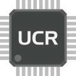
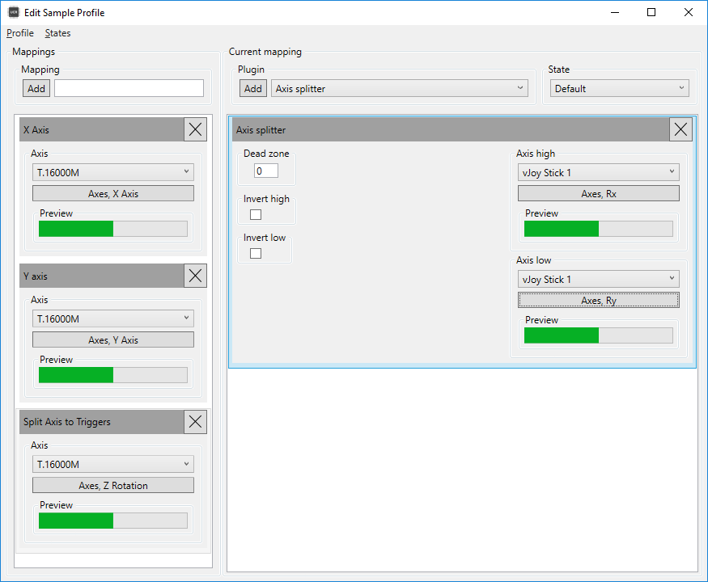

# Universal Control Remapper RELOADED

   

Universal Control Remapper RELOADED is a major architectural evolution and total UI overhaul of the original [UCR](https://github.com/Snoothy/UCR). It transforms the legacy, complex nested-tab experience into a fast, intuitive "Patch Bay" matrix workflow designed for modern simulation rigs and power users.

UCR RELOADED is a Windows application that allows you to remap inputs from any combination of devices (keyboards, mice, joysticks, racing wheels, pedals, eye trackers, etc.) into unified virtual output devices, with automatic game-profile switching and built-in device hiding.

## 🌟 Key Features

*   **The Patch Bay**: A streamlined, flat mapping matrix that dynamically builds itself based on your selected output device (e.g., Xbox 360 controller). No more digging through deep profile trees to find your mappings.
*   **Device Groups**: Combine multiple physical devices (like separate steering wheels, pedals, and shifters) into a single virtual "Group" to bind them together effortlessly.
*   **Game Profiles & Auto-Switching**: Create custom control schemes tied to specific game executables (`.exe`). UCR automatically activates the correct profile when the game launches.
*   **Integrated HidHide**: Stop games from getting confused by "double inputs" (seeing both your physical steering wheel and the virtual Xbox controller simultaneously). UCR can automatically hide specific hardware from the game per-profile.
*   **Advanced Mergers & Filters**: Easily merge multiple buttons or axes onto a single output (e.g., dual sticks to one axis), add modifier filters ("shift states"), and tweak deadzones, anti-deadzones, and response curves.
*   **Stable Device Identity**: Devices are tracked by their hardware IDs, meaning your mappings won't break if you plug your controller into a different USB port.
*   **Virtual Keyboard Output**: Send genuine key presses directly to games that don't support custom virtual controller buttons.

---

## 📖 How to Use UCR RELOADED

### 1. Organizing Your Hardware (Devices Tab)
When you first open UCR RELOADED, head to the **Devices** tab.
- **Checkmarks**: Use the checkboxes to select the physical device you want to map from.
- **Device Groups**: If your setup uses multiple USB devices (e.g., a wheel base on one USB, pedals on another), use the gear icon to open **Device Manager** and create a **Group**. You can then select this Group as your input scope, treating all those devices as one unified input source.
- **Scope to Profile Association**: You can link your selected device or group directly to a specific Game Profile using the inline association button.

### 2. Creating a Game Profile
Instead of a complex tree of profiles, everything is managed via the **Toolbar**.
- Click the profile chip at the top to create or edit a Game Profile.
- Name your profile and link it to a game's executable (`.exe`). This ensures UCR only applies your bindings when that game is running.
- **HidHide Integration**: In the Profile Editor, you can check boxes under "Hide Devices From Game" to make sure the game only sees your virtual controller, preventing conflicts.

### 3. Binding Inputs (The Patch Bay)
Once you have an active profile and an input scope selected, click the **Begin Mapping** button.
- **The Matrix**: The Patch Bay will automatically generate a row for every possible input on your chosen output device (e.g., all buttons and axes for an Xbox 360 controller).
- **Listen Mode**: Simply click the **Listen** button on any row and press the physical button or move the axis on your controller. UCR will instantly bind it.
- **Merge Inputs (+1)**: If you click Listen on a row that is already bound, UCR automatically converts it into a Merger, allowing multiple physical buttons to trigger the same output.

### 4. Advanced Tweaking (The ⋯ Panel)
Every row in the Patch Bay has an **Advanced Panel (⋯)** for deep customization.
- **Filters**: Assign modifier conditions (e.g., "Only trigger this button if Filter A is Active").
- **Curves & Deadzones**: Adjust Response Curves, Deadzones, and Anti-Deadzones for precise axis control (essential for steering wheels and pedals).
- **Half-Axis / Splitting**: If you need to separate or combine pedal inputs, use the axis properties in this panel.

---

## 🛠 Device Support

UCR RELOADED supports a massive range of hardware through the integrated `IOWrapper` backend.

**Inputs:**
- DirectInput (Racing wheels, HOTAS, generic gamepads, etc.)
- XInput (Xbox 360 / Xbox One controllers)
- Keyboard & Mouse (via Interception)
- Tobii Eye Trackers, DS4Windows API, MIDI devices, and more.

**Outputs:**
- Xbox 360 Controller (via ViGEm)
- DualShock 4 Controller (via ViGEm)
- DirectInput Controllers (via vJoy)
- Virtual Keyboard (SendInput keystrokes)

## 💻 Building and Contributing

UCR RELOADED is built on .NET 8 WPF. 

To build the project:
1. Run `.\build.ps1 InitProject` from PowerShell to initialize dependencies and unpack the vendored IOWrapper.
2. Ensure you have the .NET 8 SDK installed.
3. Open `UCR.sln` in Visual Studio 2022 and build as normal.

**Note:** If restoring NuGet packages fails, ensure you are building from a local drive (e.g., `C:\`) rather than a mapped network drive, as legacy `packages.config` restores can silently fail over network paths.

## 📄 License

Universal Control Remapper RELOADED is Open Source software released under the [MIT license](https://github.com/Snoothy/UCR/blob/master/LICENSE).
